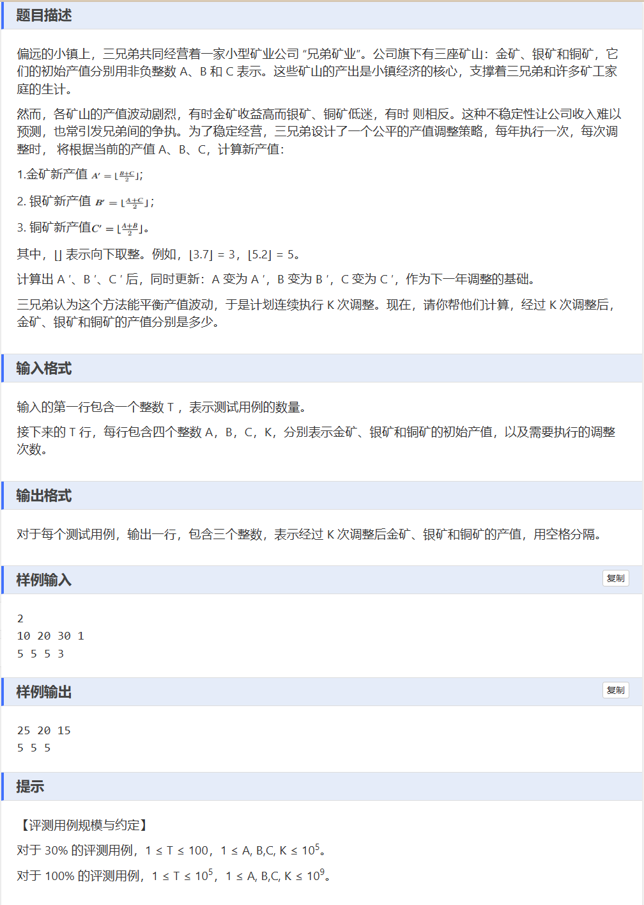

# 题目 3320: 蓝桥杯2025年第十六届省赛真题-产值调整
  

**初始版代码**
```
#include<iostream>
#define ll long long

using namespace std;

void calculation(ll &A, ll &B, ll &C, ll &K) {
	for (int i = 0; i < K; i++) {
		ll temp1 = A;
		ll temp2 = B;
		ll temp3 = C;
		A = (temp2 + temp3) >> 1;
		B = (temp1 + temp3) >> 1;
		C = (temp2 + temp1) >> 1;
	}
}
ll A, B, C, K, T;
int main() {
	cin >> T;
	for (int j = 0; j < T; j++) {
		cin >> A >> B >> C >> K;
		calculation(A, B, C, K);
		cout << A << " " << B << " " << C ;
		cout << endl;
	}
	return 0;
}
```
### 该版答案未经过优化，便会有这样的结果


我们想想哪里可以优化一下  
## 全局方面的优化，
首先C艹中的cin与cout是和C的stdio库默认同步的，我们可以关闭同步以加快io速度，接近 scanf/printf 的速度
```
//ios 即是in out stream的首字母组合
	ios::sync_with_stdio(false);//sync即是synchronize同步的前四个字母
	cin.tie(nullptr);//解除 cin 与 cout 的绑定关系。
```
处理大量 IO 时的**标配优化**

## 在流程上进行具体的优化
```
//带有inline标记的函数可以建议编译器对函数进行内联展开优化。
//何为内联优化
//其在编译时，会直接替换到调用它的地方，类似于宏替换，消除函数调用的开销，提升运行速度
//但其仅适合短小简单的函数，不适合递归、循环等
inline bool areEqual(ll a, ll b, ll c) {
	return a == b&&b == c;
}//这种函数中就算只有一句话也需要加上括号
```
```
	if (areEqual(A, B, C)) break;
```
### 两部分组合起来就可以将A=B=C的情况直接输出，尽可能减少运行时间

