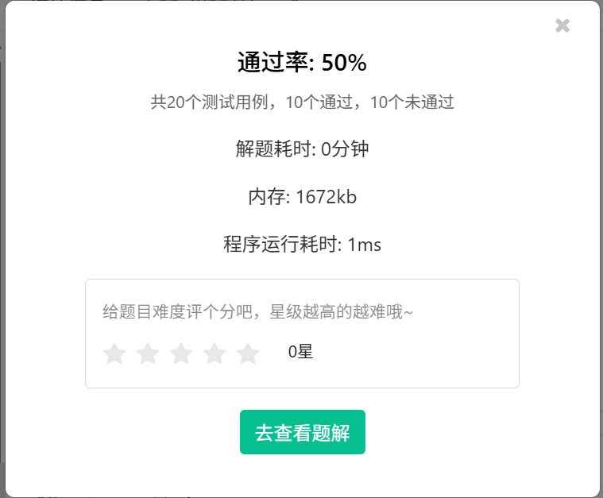

# 题目 3320: 蓝桥杯2025年第十六届省赛真题-产值调整
  

**初始版代码**
```
#include<iostream>
#define ll long long

using namespace std;

void calculation(ll &A, ll &B, ll &C, ll &K) {
	for (int i = 0; i < K; i++) {
		ll temp1 = A;
		ll temp2 = B;
		ll temp3 = C;
		A = (temp2 + temp3) >> 1;
		B = (temp1 + temp3) >> 1;
		C = (temp2 + temp1) >> 1;
	}
}
ll A, B, C, K, T;
int main() {
	cin >> T;
	for (int j = 0; j < T; j++) {
		cin >> A >> B >> C >> K;
		calculation(A, B, C, K);
		cout << A << " " << B << " " << C ;
		cout << endl;
	}
	return 0;
}
```
该版答案未经过优化，便会有这样的结果

