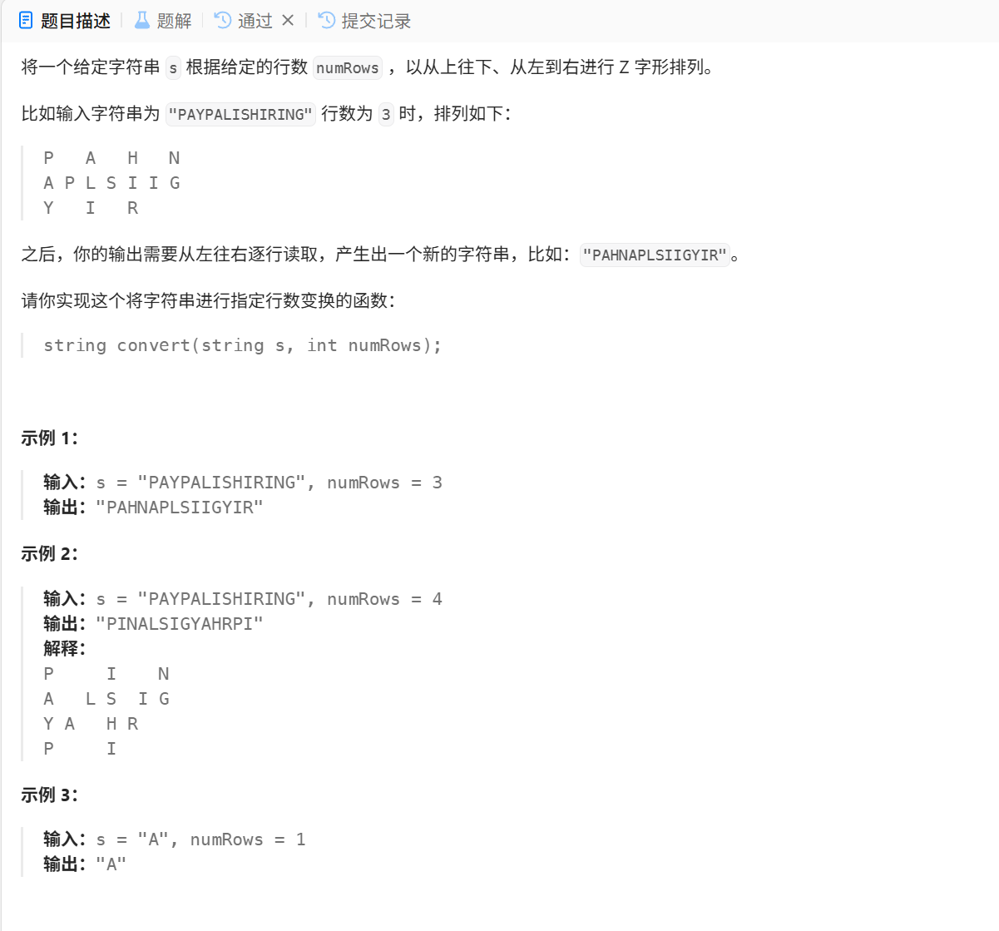

#  Z 字形变换
  
## 核心代码是什么呢？
准备阶段代码，最核心部分
```
for(char c:s){
    list[i].push_back(c);
    if(i==0||i==numRows-1)
        flag = -flag;
    i+=flag;
}
```
结果输出阶段代码，此核心部分
```
     string res;
     for(string &c:list)
  1·这里不加& 也是可以运行的
  2.加上&的作用是减少运行成本
  3.带上&之后进行的就是传址调用
    不加就是传值调用，传值调用
    需要复制一份原本的值，会浪费
    空间和时间
  4.一般对于短小数据且不需要进行修改时
    进行传值调用，长的就是用传址调用来
    进行缩减
    
     res+=c;
     return res;
```

## 完整版代码
```
class Solution {
public:
    string convert(string s, int numRows) {
        if(numRows<2) return s;
        vector<string>list(numRows);
        int i=0,flag=-1;
        for(char c:s){
            list[i].push_back(c);
            if(i==0||i==numRows-1)
            flag=-flag;
            i+=flag;
        }
        string res;
        for(string &c:list)//这里不加&也可以运行，不过会增加运行成本
        res+=c;
        return res;
    }
};
```


